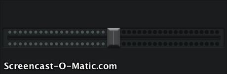

LARSBar
===========

A `UISlider` subclass mimicking the awesome EQ slider found on Twitter's #music app. Named like this because my friends kept calling it this - and I really can't come up with anything better.

You'll need to bring your own assets for the frame, track and slider thumb, or just use the ones I've created in the sample project - I don't care. I've included the PSD files.

Excuse the crummy gif screen capture quality, the performance is quite good and there are no gaps in the animation:  


##Interface
Pretty simple interface:

``` lang:objective-c
/** The value for the left channel eq in the range of 0 to 1.
 
 @warning This value is clipped at 1.
 */
@property (nonatomic, assign) CGFloat leftChannelLevel;

/** The value for the right channel eq in the range of 0 to 1.
 
 @warning This value is clipped at 1.
 */
@property (nonatomic, assign) CGFloat rightChannelLevel;

/** The inactive color for the eq. This is the color that the eq light takes on past the right side of the slider thumb knob.
 */
@property (nonatomic, strong) UIColor *inactiveColor;

/** The active color for the eq when it is available to be lit up. This is the color that the eq light takes on before the slider thumb knob.
 */
@property (nonatomic, strong) UIColor *activeColor;

/** The EQ light glow colors. The number of light sections the light takes on depends on how many colors you pass in here.
 */
@property (nonatomic, copy) NSArray *glowColors;
```

In addition to all of the above, since this is just a `UISlider` subclass, you can treat it just like you would a normal `UISlider` (Using `UIAppearance`, etc).

##License
MIT License. Go nuts.

##Homepage
If you're not on github right now reading this, you can find the page here: https://github.com/larsacus/LARSBar

##Other
Demo project uses [Novocaine](https://github.com/alexbw/novocaine) for audio input. Other than that - have fun.

Yours truly,

_Lars_ ([@theonlylars](http://twitter.com/theonlylars))


[](https://bitdeli.com/free "Bitdeli Badge")

